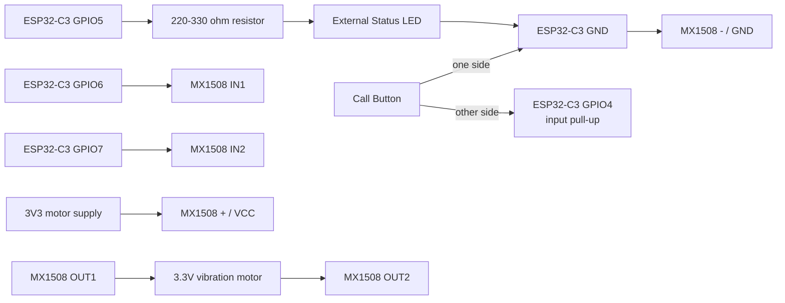

# Development Manual

이 문서는 CaregiverCall 개발 환경 설정, 컴파일, 업로드, 초기 하드웨어 결선 기준을 설명합니다.

## 디렉터리 구조

- `src/`: ESP32-C3 Super Mini 펌웨어 소스 코드
- `lib/`: 프로젝트 내부 라이브러리 또는 외부 라이브러리 래퍼
- `docs/`: 제품 요구사항, 개발 매뉴얼, 셋업 매뉴얼, 사용 매뉴얼
- `scripts/`: 개발 환경 설정과 자동화 스크립트

## 개발 환경 설정

펌웨어 스택은 ESP-IDF + esp-matter를 사용합니다.

1차 목표는 ESP32-C3 Super Mini가 Google Home에서 Matter On/Off Switch로 표시되도록 만드는 것입니다.

Python 도구가 필요한 경우 저장소 로컬 `.venv`를 사용합니다.

Windows PowerShell:

```powershell
.\scripts\setup_python_env.ps1
```

macOS/Linux:

```sh
./scripts/setup_python_env.sh
```

Python 의존성은 `requirements.txt`에 기록합니다.

## 개발보드

- 보드: ESP32-C3 Super Mini
- 연결: USB-C 또는 보드에 맞는 USB 케이블
- 주요 기능: Matter over Wi-Fi, 물리 호출 버튼 입력, 사용자 피드백 출력
- 보드 참조 이미지: https://europe1.discourse-cdn.com/arduino/optimized/4X/b/4/1/b41cb5d47221f72dce90d2227369a7aa359fa2d0_2_690x389.jpeg

ESP32-C3 Super Mini 보드는 제조사와 판매처에 따라 핀 배치 표기가 다를 수 있습니다. 아래 결선은 초기 개발 기준안이며, 실제 연결 전 보드 실크스크린과 핀맵을 확인하세요.

## 초기 결선도

초기 펌웨어 기준 핀 제안:

- 호출 버튼: `GPIO4`
- 외부 상태 LED: `GPIO5`
- MX1508 진동 모터 드라이버 제어 신호: `GPIO6`, `GPIO7`
- 전원: `3V3`, `GND`
- MX1508 모듈 참조 이미지: https://ae01.alicdn.com/kf/Scd3bb02492b64cd89a5f1e06951d5baaK.jpg



## 결선 표

| 기능 | ESP32-C3 Super Mini 핀 | 외부 부품 | 비고 |
| --- | --- | --- | --- |
| 호출 버튼 | `GPIO4` | 순간 누름 버튼 | 버튼의 다른 쪽은 `GND`, 펌웨어에서 내부 pull-up 사용 |
| 상태 LED | `GPIO5` | 외부 LED + 220-330 ohm 저항 | 호출 중, 전송 실패, 확인 완료 상태 표시 후보 |
| 진동 IN1 | `GPIO6` | MX1508 `IN1` | 진동 모터 채널 A 제어 |
| 진동 IN2 | `GPIO7` | MX1508 `IN2` | 진동 모터 채널 A 제어 |
| 진동 출력 | MX1508 `OUT1`, `OUT2` | 3.3V 소형 진동 모터 | GPIO에 모터를 직접 연결하지 않습니다. |
| 모터 드라이버 전원 | `3V3`, `GND` | MX1508 `+`/`VCC`, `-`/`GND` | ESP32-C3와 MX1508의 GND는 반드시 공통으로 연결합니다. |
| 전원 | `3V3`, `GND` | 보드 전원 | USB 전원 또는 안정적인 3.3V 전원 사용 |

## MX1508 진동 모터 제어 기준

3.3V 소형 진동 모터는 MX1508의 한 채널만 사용합니다. 기본 채널은 `IN1/IN2`와 `OUT1/OUT2`입니다.

| `IN1` | `IN2` | 동작 |
| --- | --- | --- |
| LOW | LOW | 정지 |
| HIGH 또는 PWM | LOW | 진동 |
| LOW | HIGH 또는 PWM | 반대 방향 진동 |
| HIGH | HIGH | 브레이크 |

진동 모터는 방향이 중요하지 않으므로 기본 구현에서는 `IN1`을 구동하고 `IN2`는 LOW로 둡니다. 빠른 정지가 필요하면 `IN1`과 `IN2`를 모두 HIGH로 두는 브레이크 동작을 실험할 수 있습니다.

## 1차 펌웨어 목표

- ESP-IDF + esp-matter 프로젝트를 구성합니다.
- Google Home에서 Matter On/Off Switch로 표시되도록 합니다.
- 이 단계에서는 버튼 입력, LED, 진동 모터 제어를 최소화하거나 더미 처리할 수 있습니다.
- Google Home에 정상적으로 페어링되고 스위치 상태가 보이는 것을 1차 완료 기준으로 둡니다.

## 버튼 입력 기준

- 기본 상태: 내부 pull-up으로 `HIGH`
- 버튼 누름: `LOW`
- 큰 버튼 1회 입력으로 호출합니다.
- 디바운스: 최소 30-80 ms 후보
- 한 번 호출한 뒤 짧은 시간 동안 재입력을 무시해 중복 호출을 방지합니다.
- 긴 누름, 중복 입력, 손 떨림 입력을 고려해 상태 머신으로 처리합니다.
- 재부팅하면 이전 호출 상태를 복원하지 않고 대기 상태로 초기화합니다.

## 컴파일

ESP-IDF 프로젝트가 추가되면 이 섹션에 `idf.py build` 기준 절차를 기록합니다.

## 업로드

ESP-IDF 프로젝트가 추가되면 이 섹션에 포트 확인과 `idf.py flash monitor` 기준 절차를 기록합니다.

## 검증 체크리스트

- Google Home에서 기기가 Matter On/Off Switch로 표시되는지 확인합니다.
- 버튼 1회 입력이 호출 상태 1회로 처리되는지 확인합니다.
- 연속 입력이나 손 떨림 입력이 과도한 중복 호출을 만들지 않는지 확인합니다.
- Matter 페어링 후 전원 재시작 시 다시 연결되는지 확인합니다.
- 보호자 확인 후 Nest Mini 음성 안내와 로컬 피드백이 동작하는지 확인합니다.
